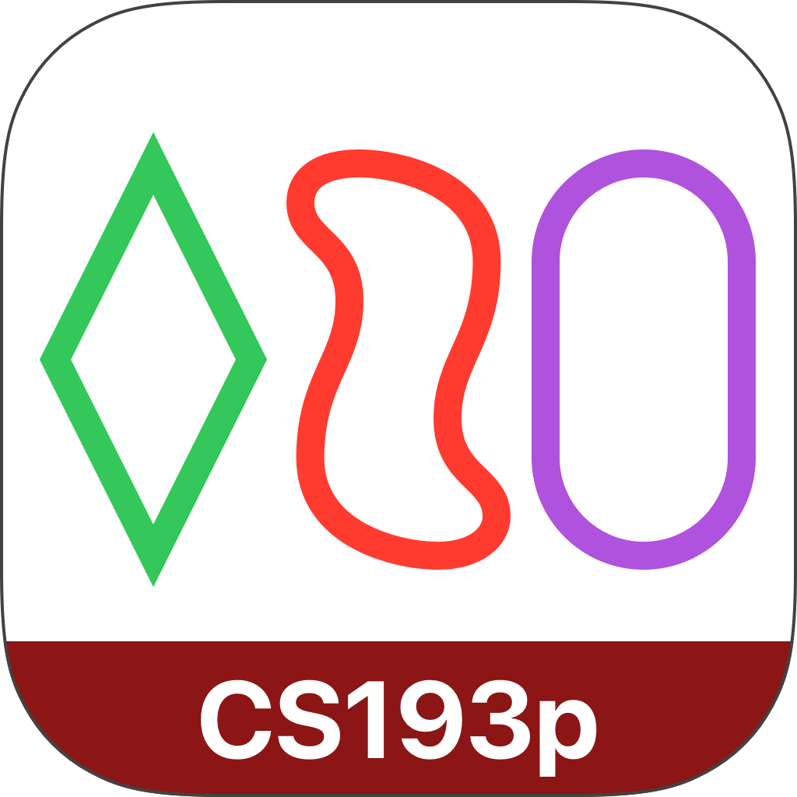

# CS193p SetGame

Stanford CS193p, Spring 2020  

[https://cs193p.sites.stanford.edu/](https://cs193p.sites.stanford.edu/)  

  

Assignment 3, Game of Set

## Required Tasks

Unfinished or modified tasks:

> Task 2. When your game is run for the very first time, there should briefly be no cards showing...

The game shows 12 cards by default on launch. (possible due to the use of LazyVGrid?)

> Task 7. After 3 cards have been selected, you must indicate whether those 3 cards are a **match** or mismatch. ...

The game automatically collects the three matched cards and animates them to the bottom of the screen. This interaction change also affects the required tasks 9 and 11.

## Extra Credit

Implemented extra credit 3, 4, 6, and 10.

## Mac Catalyst

This app also runs on macOS with Mac Catalyst.